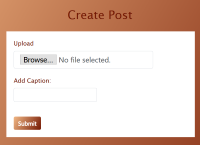
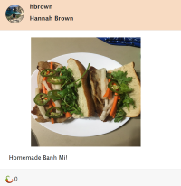
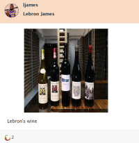
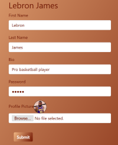

# Spice Social Media Network

The purpose of the Spice Social Media Network is to provide a system that encourages users to share food and fun on their feeds as a way to interact with their friends.

The new Spice design will incorporate:
- Back-End: Spring MVC/SpringBoot, Hibernate/SpringDataJava, PostgreSQL, etc
- Front-End: Angular, HTML, CSS, JavaScript, AJAX, Bootstrap, etc

This project also incorporates cookies, AWS, Jenkins, and Trello.

### Project Setup (Spring Tool Suite, AWS, and DBeaver)
- Clone this repository to your machine.
- Set up your database in Amazon RDS through the AWS website.
- Save the endpoint connection(url), the username, and the password used to set up your database.
- Add these values into the database.properties file.
- Set up a connection in DBeaver using the url to establish a connection.
- Make sure you have Apache Tomcat version 9.0 installed.
- Run the spice.sql file to create a new schema and create new tables.
- Import `spice` folder into Spring Tool Suite
- Run the spice project in Spring Tool Suite and the console application is ready for you to use. Make sure to add the project to the server.
- Start the server.

### Angular Instructions:

- Import the `spicegirls-angular-all` folder into Visual Studio
- Run the following terminal commands in Visual Studio's Terminal:

Install dependencies:

```sh
npm install bootstrap jquery --save
npm install @fortawesome/fontawesome-svg-core
npm install @fortawesome/free-solid-svg-icons
npm install @fortawesome/angular-fontawesome@0.5.0
npm install ngx-cookie-service
```
Run application:

`ng serve -o`

### Login
- Sample login credential:

```sh
username: ljames
password: bball
```

### Business Requirements
Each user should be able to:
- Register, Login, and Logout
- Reset their password
- Upload a profile picture
- Modify their user information
- Create a post
- View own profile and post
- View others’ profile and post
- Search other people
- See everyone's feed
- Like someone’s post

### Technologies
Front-End Technologies
- Angular
- HTML
- CSS
- Javascript
- Bootstrap
- AJAX

Back-End Technologies
- Java 1.8
- Spring MVC/SpringBoot
- Hibernate/SpringData
- Tomcat Server
- PostgreSQL 12
- AWS (S3, EC2)

Testing Applications
- JUnit
- log4j 

WorkSpace Applications:
- Eclipse/Spring Tools Suite
- DBeaver
- Jenkins
- Github
- Visual Studio

### SDLC:
SCRUM : 
- [Trello](https://trello.com/b/M0AWhrYz/spice-girlz)

### Feature Screenshots
- **User Profile**


- **Create Post**



- **User Post**




- **Nav Bar**


- **Search**


- **Like**


- **Update Info**



